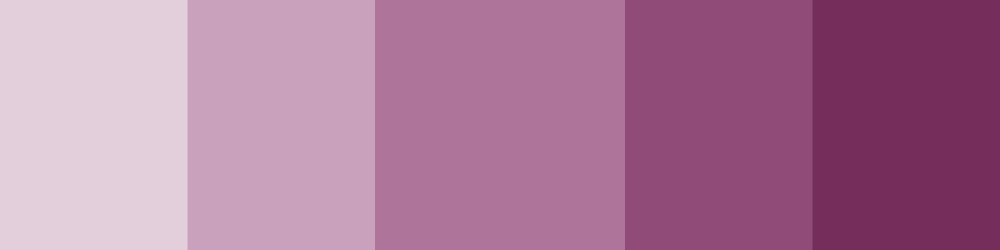

# ethereon
Base repository of colors

## Color Samples

<table>
  <tr>
    <th>-1</th>
    <th>-2</th>
    <th>-0</th>
    <th>-2</th>
    <th>-3</th>
  </tr>
  <tr>
    <td colspan="5"></td>
  </tr>
  <tr>
    <td>#BED1CF</td>
    <td>#86A8A4</td>
    <td>#5E8D87</td>
    <td>#3D766E</td>
    <td>#255F57</td>
  </tr>
  <tr>
    <td colspan="5"></td>
  </tr>
  <tr>
    <td>#FFFAE7</td>
    <td>#FFF5CB</td>
    <td>#E1D696</td>
    <td>#BCAB62</td>
    <td>#98863B</td>
  </tr>
  <tr>
    <td colspan="5"></td>
  </tr>
  <tr>
    <td>#E3CEDC</td>
    <td>#CAA1BC</td>
    <td>#AE7499</td>
    <td>#914B79</td>
    <td>#752E5C</td>
  </tr>
  <tr>
    <td colspan="5"></td>
  </tr>
  <tr>
    <td>#FFF1E7</td>
    <td>#FFE1CB</td>
    <td>#E1B596</td>
    <td>#BC8762</td>
    <td>#98623B</td>
  </tr>
  <tr>
    <td colspan="5"></td>
  </tr>
  <tr>
    <td>#D9EBD5</td>
    <td>#B4D9AD</td>
    <td>#88BC7D</td>
    <td>#5F9D52</td>
    <td>#3F7F31</td>
  </tr>
  <tr>
    <td colspan="5"></td>
  </tr>
  <tr>
    <td>#CBC7D9</td>
    <td>#9C97B7</td>
    <td>#766E9B</td>
    <td>#554B82</td>
    <td>#3B3169</td>
  </tr>
  <tr>
    <td colspan="5"></td>
  </tr>
  <tr>
    <td>#FBE4E6</td>
    <td>#F7C5CA</td>
    <td>#D99198</td>
    <td>#B65E67</td>
    <td>#933942</td>
  </tr>
  <tr>
    <td colspan="5"></td>
  </tr>
  <tr>
    <td>#C4CAD6</td>
    <td>#909CB1</td>
    <td>#687995</td>
    <td>#465B7D</td>
    <td>#2D4265</td>
  </tr>
</table>
